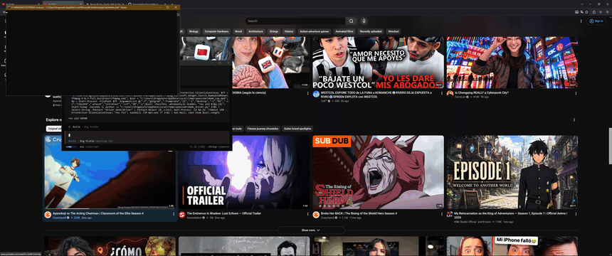

# animelite-cli

Buscador y reproductor de anime por consola. Reúne resultados de varias
fuentes, los agrupa, lista los servidores disponibles con su latencia y
reproduce el mejor enlace con **mpv** (HLS, DASH y mp4).

No requiere navegador: todo se resuelve con la librería estándar de Python.

## Demo



## Requisitos

- **Windows 10/11** (cmd o PowerShell).
- **Python 3.10 o superior** (probado en 3.10.11).
- **mpv** — necesario solo para reproducir.
- **Internet** (las fuentes se consultan en vivo).

> Sin mpv la aplicación arranca, busca, lista episodios y mide latencia sin
> problema; lo único que no hace es reproducir (te avisa cómo instalarlo).

## Instalación

1. **Hacer doble clic en `instalar.bat`** (o, desde una terminal,
   `python instalar.py`).

El instalador hace por ti:

1. Verificar Python 3.10+ (si falta, indicar cómo instalarlo con `winget`).
2. Crear el entorno virtual `.venv` e instalar las dependencias.
3. Detectar mpv (variable `MPV_PATH`, archivo de config, `PATH` o rutas
   habituales). Si no lo encuentra, **preguntar si instalarlo con winget**.
4. Guardar la ruta de mpv en `%APPDATA%\animelite\config.json`.
5. Crear los lanzadores: `anime.bat` y el comando global **`animelite`**.

2. **Abrir una terminal nueva** y escribir:

```
animelite
```

También funciona `anime.bat` (doble clic dentro de la carpeta).

### Instalación manual

```bat
git clone https://github.com/DragonyteEvol/animelite-cli.git
cd animelite-cli
python -m venv .venv
.venv\Scripts\pip install -r requirements.txt
.venv\Scripts\python main.py
```

## Uso

1. **Escribir** el nombre del anime y **elegir** el resultado de la lista.
2. **Elegir** el número del capítulo.
3. La app revisa sus fuentes, resuelve los servidores, mide su latencia y
   **abre de forma automática el mejor enlace en mpv**.

Menú tras reproducir:

- `Entrar` — siguiente capítulo
- `a` — capítulo anterior
- `n` — elegir otro número
- `v` — elegir otro servidor
- `b` — buscar otro anime
- `q` — salir

Dentro de la lista de servidores: `i` (número del servidor) para abrir uno,
`r` para volver a escanear (los enlaces vencen), `m` para volver al menú.

## El reproductor (mpv)

El programa busca mpv en este orden:

1. **`MPV_PATH`** (variable de entorno) — apuntar directamente al exe, p. ej.
   `set MPV_PATH=C:\ruta\a\mpv.exe`.
2. **`mpv_path`** del archivo de config `%APPDATA%\animelite\config.json`
   (lo escribe el instalador).
3. **`PATH`** — `mpv` accesible desde la terminal (instalación con winget o
   zip manual).
4. **Rutas habituales** — `C:\Program Files\mpv`, `%LOCALAPPDATA%\Programs\mpv`,
   `C:\Users\Public\Documents\mpv`, etc.

### Instalar mpv

Con winget:

```bat
winget install --id shinchiro.mpv -e
```

O manual: **descargar** el zip de mpv, **descomprimirlo** en una carpeta y
**añadir** esa carpeta al `PATH` (o definir `MPV_PATH`).

### Si la app no encuentra mpv

Muestra el comando para instalarlo. Después de instalarlo, **reiniciar** el
programa o **volver a ejecutar** `instalar.bat` para detectar y guardar la
ruta.

## Configuración avanzada

- `MPV_PATH`: ruta al `mpv.exe` (prioridad máxima sobre la detección).
- `MPV_EXTRA`: argumentos extra para mpv, p. ej. `MPV_EXTRA=--hwdec=no`.
- `%APPDATA%\animelite\config.json`: config generada por el instalador con la
  clave `mpv_path`.

## Problemas frecuentes

- **"No se encontró mpv"** — instalar mpv y lanzar de nuevo el instalador, o
  definir `MPV_PATH`.
- **"Ningún servidor respondió a prueba de velocidad"** — los CDN caen o la
  URL venció; **volver a intentar** o usar `r`.
- **Fallan todos los servidores de un capítulo** — suele ser temporal
  (anti-bot o CDN); **intentar más tarde**.
- **Sin colores en la consola** — instalar `colorama`; es opcional.

## Estructura

```
main.py            CLI principal (búsqueda, réplica, menú)
sitios/            adaptadores por fuente
resolvers/         resolución de enlaces embebidos
core/              cliente HTTP, modelo, sondeo de latencia
reproductor.py     detección y lanzamiento de mpv
config.py          config de usuario (%APPDATA%\animelite\config.json)
instalar.py/.bat   instalador (entorno, dependencias, mpv)
anime.bat          lanzador local
```